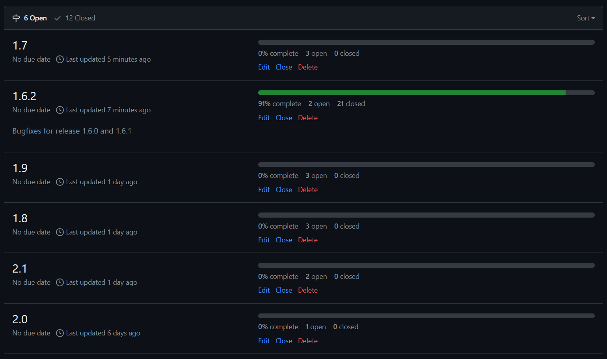
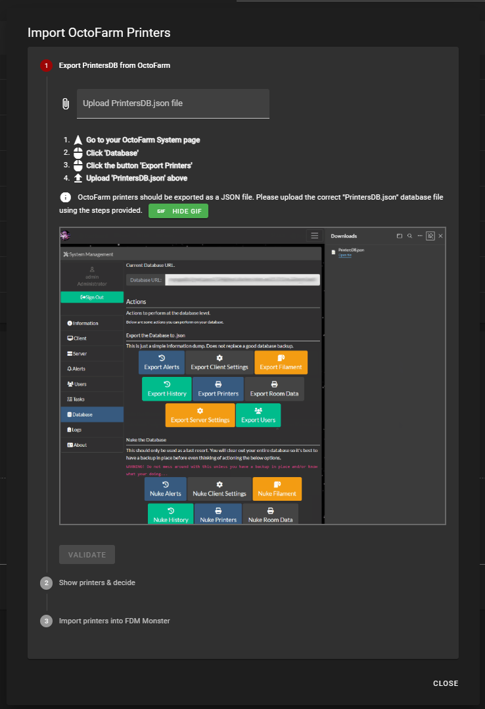
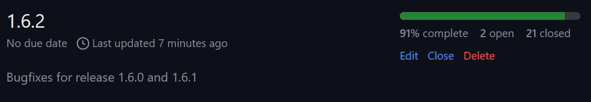

## 📆 Planning

The past two weeks have been mostly about planning and refining the work for FDM Monster. It has become clearer to me and others that the project needs a cleaner roadmap.

Together with @Dyrant we've been able to formalize the roadmap and shape the work into [Github Milestones](https://github.com/fdm-monster/fdm-monster/milestones)
The result is a development cycle which slightly looks different than what was before:

- a set of specific features are selected for a release (version 1.6.0)
- in a follow-up cycle, bugs are collected, prioritized and fixed (for example 1.6.1, 1.6.2 and so on)
- and then the next cycle: work towards a new release starts (for example 1.7.0 with Klipper support), but also work on documentation, site and overall code quality (administration)

<!-- truncate -->

## 🥌 Smooth ride towards 1.6.2

The updates for FDM Monster 1.6.2 have been long-awaited bugfixes! It really felt great to fix things like OctoFarm printer import, YAML import issues, SQLite database problems, and a bunch more of UI changes.

It is mostly due to feedback by the likes of @Smart Home Sellout that gave the inspiration to add a GIF to clarify the OctoFarm printer import process. That was a huge improvement and a great idea.

## 🖨️ Wait Klipper support in 1.7.0??

You read that right! Huge change, I'm super stoked to get to work on this in the next weeks after 1.6.2 has been shipped.

## 🥂 Let's celebrate

I just wanted to take a small moment to celebrate that FDM Monster is nearly 3 years old! Thanks for being with me along the way. You guys rock!
