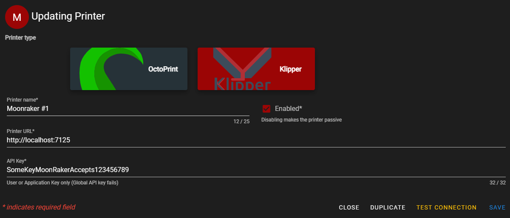

## Klipper support

After the work on 1.6.2 I have started work on Klipper for FDM Monster 1.7.0 🥳

<!-- truncate -->

## ❔ Poll

The poll for filament tracking was announced a couple of days ago. The idea is to estimate what you are using for this, so integration work for FDM Monster can be planned around this in the future.
Find it [here](https://github.com/fdm-monster/fdm-monster/discussions/3142)
