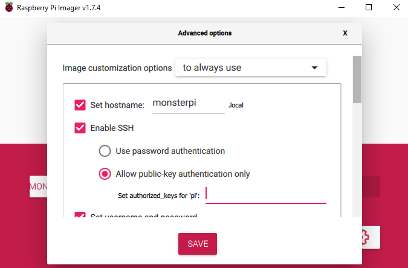

# MonsterPi for Raspberry Pi

This page helps you set up the MonsterPi image on your Raspberry Pi.

MonsterPi is a Raspberry Pi image built using CustomPiOS.
The source repository with its releases is [found
here](https://github.com/fdm-monster/MonsterPi).
This raspberry pi image includes FDM Monster and MongoDB.
All released image versions can be downloaded from the [Releases](https://github.com/fdm-monster/MonsterPi/releases) page.

## Latest Version - MonsterPi 0.3.1

**MonsterPi 0.3.1** can be downloaded from Github Releases: [MonsterPi 0.3.1 release](https://github.com/fdm-monster/MonsterPi/releases/tag/0.3.1).
Please unzip the file before flashing it to your SD card.

Older **MonsterPi releases** can be downloaded Github Releases: [MonsterPi releases](https://github.com/fdm-monster/MonsterPi/releases).

## Installing MonsterPi

Steps:

1) Download [Raspberry Pi Imager](https://www.raspberrypi.com/software/)

2) Insert a 16GB+ SD Card of high quality (class 10) and decent brand, **do not save money on this**!

3) Flash the image on the SD card. Do not forget to set the configuration (WiFi, SSH, hostname) according to your
   specifications: 

4) Insert the SD card into your Raspberry Pi 3 or 4 and power it up (with a recommended 5.1V power supply)

5) Visit [http://monsterpi.local:4000](http://monsterpi.local:4000) to access FDM Monster

6) Alternatively you can visit [http://monsterpi.local](http://monsterpi.local)
   or [https://monsterpi.local (Self-Signed SSL Certificate)](https://monsterpi.local) to access FDM Monster

# Updating FDM Monster in MonsterPi

I assume you know how to SSH into your MonsterPi. For me the following SSH entry (See `~/.ssh/config`) works well:

```ssh/config
Host monsterpi
   HostName monsterpi.local
   User yourcustompiuser # replace with your user
   # PasswordAuthentication true # I Do not like using passwords
   IdentityFile ~/.ssh/id_rsa_file # Replace with your SSH Key
   Port 22
```

Personally I like the [VS Code SSH extension](https://code.visualstudio.com/docs/remote/ssh) for this!

# MonsterPi Version 0.2.0/0.3.0+

Run the following commands to change to the `pi` user and execute an update with root elevation.

```bash
# Change to pi user
sudo su pi

cd /home/pi/fdm-monster-daemon

# Deploy the fdm-monster server update
sudo bash ./update-fdm-monster.sh 
```

## Updating MonsterPi manually 0.1.x -> 0.2.0

This strategy allows you to stick with 0.1.1. I cannot recommend it in the long run however, because the image of 0.2.0
has changed quite a bit.

This script will not install:

- HAProxy
- gencert (SSL certificate generator)
- welcome script

We will be downloading a gist from Github. You can also download the latest version of the file yourself
from [this Github URL](https://github.com/fdm-monster/MonsterPi/blob/main/src/modules/monsterpi/filesystem/home/pi/fdm-monster-daemon/update-fdm-monster.sh).

```bash
# Change to pi user
sudo su pi

cd /home/pi/fdm-monster-daemon

# Remove the existing (empty placeholder file in MonsterPi 0.1.1)
rm ./update-fdm-monster.sh
# Download new script
wget https://gist.githubusercontent.com/davidzwa/f0e094bd2223a0f1907009d576ad0b77/raw/4cf65be675dc09439873d504acf25abd32cda9c3/update-fdm-monster.sh

# Deploy the fdm-monster server update
sudo bash ./update-fdm-monster.sh 
```
