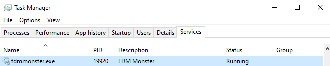

:::danger

The Windows service installation is deprecated!

Documentation for the Windows service is provided as-is and will not be supported.

:::

If you're not an experienced user, you might find some of the steps below challenging. However, if you follow them
carefully, you'll be able to install FDM Monster as a Windows service on your machine.

The installation scripts have been removed since 1.6.0 and are not supported anymore. They are available at the 1.5.4 branch, to be used at your own risk
in [installations/fdm-monster-node-windows](https://github.com/fdm-monster/fdm-monster/tree/1.5.4/installations/fdm-monster-node-windows).


*This is the FDM Monster web app after installation (visit [http://localhost:4000](http://localhost:4000))*

## Preparation for the Windows service installation

The following steps will install:

- Node.js 18 or higher
- MongoDB 4.4 or higher
- git
- yarn (npm package)
- FDM monster source files (GitHub cloned source code)
- node-windows (npm package)

### Caveats

- Internet access is required
- Windows only (if you use Linux, please use Docker)
- Pay attention to versions (e.g., Node.js 18)
- Understand PowerShell execution policy: `Set-ExecutionPolicy -ExecutionPolicy Unrestricted` will allow anything to
  run.

---

### Step 1: Installing Node.js 18+

Install Node.js LTS (long-term support) from [https://nodejs.org/en/download](https://nodejs.org/en/download). At the
time of writing, this is Node 18. The FDM Monster server requires Node.js 18 LTS or higher.

To check whether Node is installed properly, execute this in Command Prompt or PowerShell:

```powershell
node -v
```

The output should be:

```powershell
PS C:\Users\SomeUser> node -v
v18.14.2
```

---

### Step 2: Installing MongoDB 5+

Install MongoDB Community Edition
from [https://www.mongodb.com/try/download/community](https://www.mongodb.com/try/download/community).
You can use [this URL](https://fastdl.mongodb.org/windows/mongodb-windows-x86_64-6.0.5-signed.msi) to download the
MongoDB installation setup
if the previous link doesn't work.

---

### Step 2b: (Optional)

If you're an experienced user, you might want to install
the [MongoDB Developer Tools](https://www.mongodb.com/developer-tools), which provide extra tools to get insight into
your database. The following tools might be of interest:

- [Compass](https://www.mongodb.com/products/compass): Connects to your database and query/adjust collections or
  documents.
- [MongoDB VS Code Extension](https://www.mongodb.com/products/vs-code): Connects to your database inside VS Code and
  allows you to see/adjust data in place.
- [MongoDB Shell](https://www.mongodb.com/products/shell): Provides shell access to the database. For advanced users
  only!

---

### Step 3: Installing Git

Prepare the installation by ensuring you have Git installed. This will help you in updating FDM Monster in the future.
Find it here: [Git Download](https://git-scm.com/downloads)

---

### Step 4: Downloading FDM Monster

From now on we will be working inside the Powershell (preferred), or Command Prompt (CMD). You should **not** use
Administrator mode.

```powershell
Invoke-WebRequest -Uri https://raw.githubusercontent.com/fdm-monster/fdm-monster/develop/installations/fdm-monster-node-windows/download-fdm-monster-server.ps1 -OutFile .\download-fdm-monster-server.ps1
```

Please download this script in the preferred location where you want to install FDM Monster. For
example, `C:\Users\User1\fdm-monster-service\`.

Followed by:

```powershell
./download-fdm-monster-server.ps1
```

During these steps, the server will not be available for a short while. Please
check [Step 5](#step-5-checking-the-service) to verify whether your service is running.
If no errors occurred, FDM Monster should be running!

---

### Step 5: Checking the service

You've installed `fdmmonster.exe` using node-windows. Great! You should be able to check the service `fdmmonster.exe`
containing the description `FDM Monster` in Task Manager.
The service should have `Status: Running``. If this is not the case, something went wrong. Reach out to us
via [Discord](https://discord.gg/mwA8uP8CMc) for more help!



If things are working, you can open FDM Monster with this URL: [http://localhost:4000](http://localhost:4000)
or [http://127.0.0.1:4000](http://127.0.0.1:4000).

---

## Updating the service

Updating the service is possible through a PowerShell, similar to the installation. Please open a Powershell window *
*without Administrator rights**.

```powershell
Invoke-WebRequest -Uri https://raw.githubusercontent.com/fdm-monster/fdm-monster/develop/installations/fdm-monster-node-windows/update-fdm-monster.ps1 -OutFile .\update-fdm-monster.ps1
```

Please download this script in the preferred location where you have downloaded the installation script for installing
FDM Monster previously.
For example, `C:\Users\User1\fdm-monster-service\`, but not `C:\Users\User1\fdm-monster-service\fdm-monster\`!

Followed by:

```powershell
./update-fdm-monster.ps1
```

The script should succeed with your FDM Monster server running again. Please have patience, as the server will not be
available for a short while.

## Uninstalling the service

Uninstalling the service is possible through a Powershell script.

```powershell
Invoke-WebRequest -Uri https://raw.githubusercontent.com/fdm-monster/fdm-monster/develop/installations/fdm-monster-node-windows/uninstall-fdm-monster.ps1 -OutFile .\uninstall-fdm-monster.ps1
```

Run the script as follows:

```powershell
./uninstall-fdm-monster.ps1
```

Please continue to [Environment configuration](../2_configuration/preconfiguration.md) to change the environment
configuration of the FDM Monster server.
