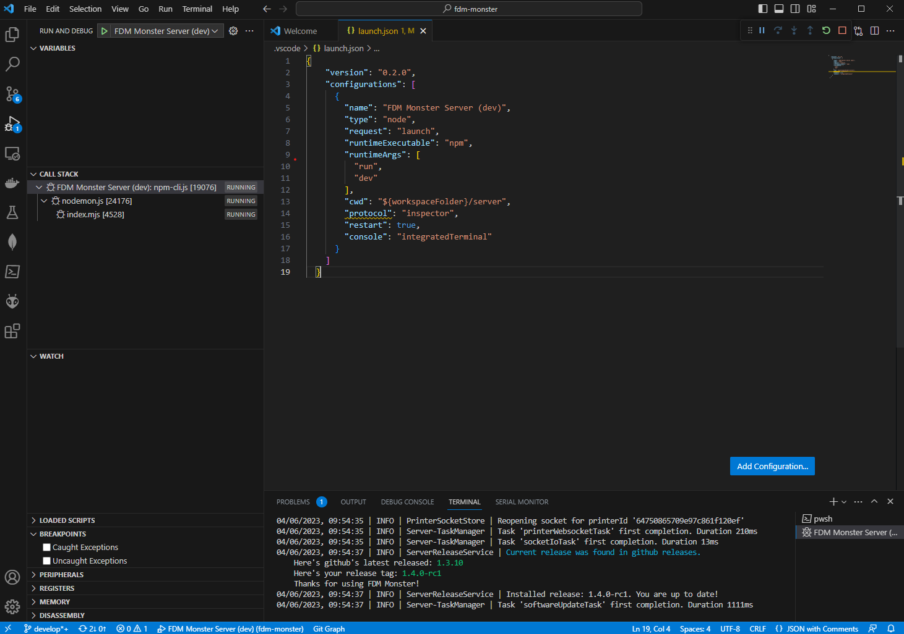
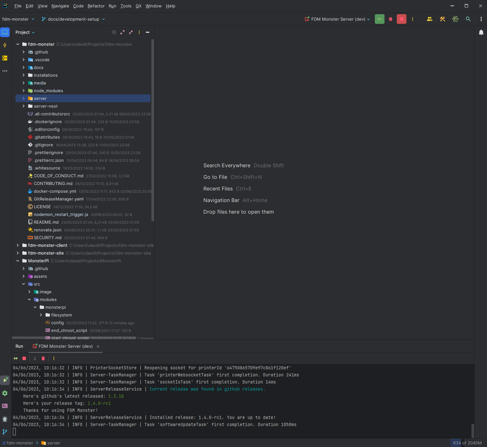

:::info
This chapter focuses solely on installing the server component!

If you want to run the FDM Monster Vue project (client) as well, please refer to the **[Client Setup](./setup_client.md)** guide.
:::

## Prerequisites

Before you begin, ensure that you have the following tools installed on your system:

- Node.js 18 LTS
- Yarn 1.22.0 or higher
- MongoDB 5 or higher
- MongoDB Compass
- VS Code or WebStorm (your choice of IDE)

## Clone the Repository

To get started, clone the FDM Monster repository from GitHub. Make sure to clone the `develop` branch

```bash
git clone -b develop https://github.com/fdm-monster/fdm-monster.git
```

## Setting Up the Development Environment

1) Navigate to the `server` folder inside the freshly cloned repository

    ```bash
    cd fdm-monster/server
    ```

1) If you haven't installed `yarn` yet, install `yarn`

   ```bash
   npm install -g yarn
   ```

1) Install the dependencies using `yarn`

   ```bash
   yarn install
   ```
  
1) Configure the environment variables by creating a .env file in the project root directory. You can use the provided `.env.template` file as a template.

1) Start the MongoDB server and make sure it is running.

1) Launch the FDM Monster server:
    - VS Code: Create a run configuration that executes `yarn run dev` as the command. (See [VS Code Run Configuration](#vs-code-run-configuration) for detailed steps.)
    - WebStorm: Create a run configuration that executes `yarn run dev` as the command. (See [WebStorm Run Configuration](#webstorm-run-configuration) for detailed steps.)

1) Access the running server at [http://localhost:4000](http://localhost:4000) in your preferred web browser.

## VS Code Run Configuration

:::tip
If the file ".vscode/launch.json" exists and looks correct, you can skip steps 2 to 4.
:::

1) Open VS Code and navigate to the **"Run and Debug"** panel.

1) Click on the link `create a launch.json file` to open the `launch.json` file. You should select Node.js as the type. If this does not work, you can manually create the file in the `.vscode` folder in the project root directory.

1) Paste the JSON content provided below into the `launch.json` file:

   ```json
   {
     "version": "0.2.0",
     "configurations": [
       {
         "name": "FDM Monster Server (dev)",
         "type": "node",
         "request": "launch",
         "runtimeExecutable": "yarn",
         "runtimeArgs": [
           "run",
           "dev"
         ],
         "cwd": "${workspaceFolder}/server",
         "protocol": "inspector",
         "restart": true,
         "console": "integratedTerminal"
       }
     ]
   }
   ```

1) Save the configuration and close the `launch.json` file.

1) In the **"Run and Debug"** panel, select **"FDM Monster Server (dev)"** from the dropdown.

1) Click on the **"Start Debugging"** button or press <kbd>F5</kbd> to launch the server. Alternatively, you can click on the green
   play button or press Ctrl + F5 to launch the server without debugging.


_Screenshot that shows the VS Code setup in action._

## WebStorm Run Configuration

To create a run configuration in WebStorm for running the FDM Monster server, follow these steps:

1) Open WebStorm and go to the **"Run"** menu.

1) Click on **"Edit Configurations..."** to open the **"Run/Debug Configurations"** dialog.

1) Click on the **"+"** icon to add a new configuration and select **"NPM"** from the dropdown.

1) Provide a name for the configuration (e.g., `FDM Monster Server (dev)`).

1) Set the `package.json` file in the cloned repository: `server/package.json`.

1) Set the Command to `run`.

1) Set the Scripts to `dev`.

1) Set the **"Node interpreter"** to the appropriate Node.js executable (e.g. v18.14.2).

1) Under the **"Environment variables"** section, click on the **"+"** icon and add a variable with the name `NODE_ENV` and value development.

1) Click **"OK"** to save the configuration.

1) In the top-right corner of WebStorm, select the created configuration from the dropdown.

1) Click on the green play button or press <kbd>shift</kbd>+<kbd>F10</kbd> to launch the server without debugging. Alternatively, you can click on the green-red bug button or press <kbd>shift</kbd>+<kbd>F9</kbd> to launch the server with debugging.


_Screenshot that shows the WebStorm setup in action._

## Next Steps

Congratulations! You have successfully set up the FDM Monster server.

The next step is to set up the FDM Monster client. Please refer to the [Client Setup](./setup_client.md) guide.
