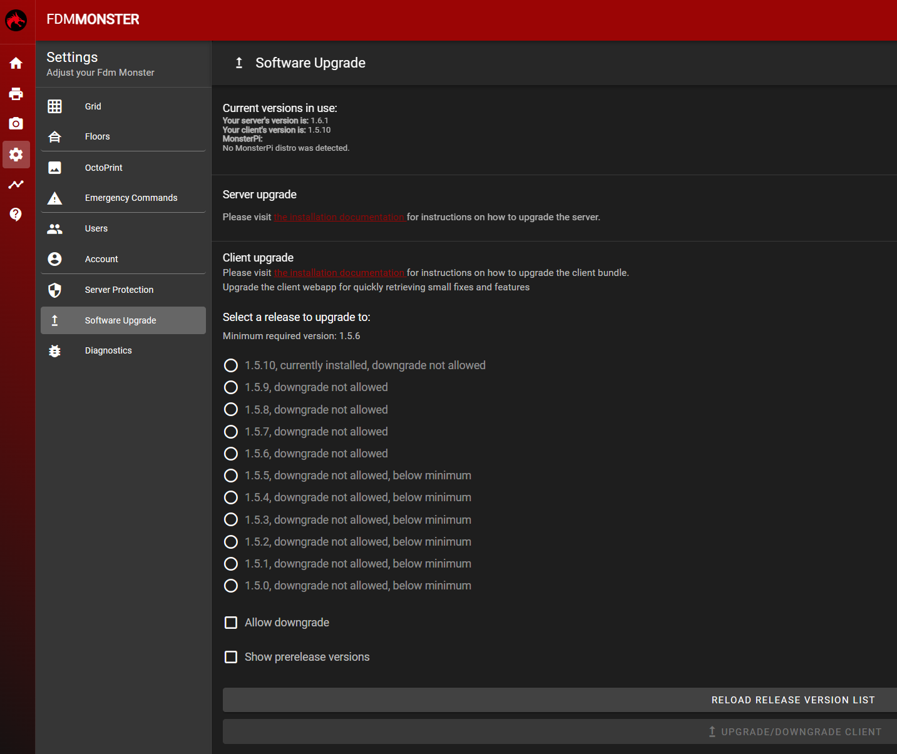

## Important: Updating the Client Bundle

The FDM Monster Client bundle is crucial for accessing the UI of FDM Monster. This guide will walk you through the
process of updating the client bundle manually.

Find the client releases and their release notes
here: [Client Release Notes](https://github.com/fdm-monster/fdm-monster-client/releases).

### Manual Client Update

To update the FDM Monster client bundle manually, follow these steps:

1) Navigate to the Settings page.
1) Click on the left navigation panel to switch to the **Software Upgrade** page.
   

1) This will open the Software Upgrade page, where you can select the client version and click the **UPGRADE/DOWNGRADE
   CLIENT**
   button to trigger the update.

Use the information attached to each version for understanding whether that version is an upgrade, the current version
or a downgrade.
Downgrades can be installed since Client version 1.5.0, but the "Allow downgrade" checkbox on the bottom must be checked
in order to execute such actions.
Please downgrade only if you understand the consequences.

Prerelease versions can also be installed by checking the "Show prerelease versions" checkbox. This however is not
advised in most cases.

:::warning
Upon confirmation, the page will reload within 5 to 10 seconds and present you with the updated bundle.
:::

## Troubleshooting

### Bundle Fails to Update

If the bundle fails to update, it could be due to one of the following reasons:

- **Server Not Running**: The server must be running for a webapp upgrade to succeed.
- **GitHub API Rate Limit**: The server's ability to download the bundle may be hindered by GitHub API rate limits. To
  resolve this:
  - Visit [Github Rate Limit documentation](https://docs.github.com/en/rest/using-the-rest-api/rate-limits-for-the-rest-api?apiVersion=2022-11-28)
  to better understand the rate limit. In order to increase the rate limit threshold, you will have to add a Github
  Personal Access Token (PAT) and set `GITHUB_PAT` environment variable to this value.
  - Alternatively, wait for a certain amount of time before attempting to upgrade the bundle again.

- **Offline Setting (Air-gapped Setup)**: In an air-gapped setup, upgrading the bundle will fail. Users in this scenario
  should be informed that they cannot upgrade using this software upgrade page. Instead, they will have to upgrade the
  server as a whole,
  which will automatically include a newer bundle.

## Advanced Information

The bundle is available on two platforms:

- [GitHub Releases](https://github.com/fdm-monster/fdm-monster-client/releases)
- [NPM Package](https://www.npmjs.com/package/@fdm-monster/client)

The client bundle is also included as an NPM package for air-gapped installations, serving as an offline fallback.
Alternatively, and most commonly applied, the bundle is verified, downloaded, and extracted from GitHub during startup.
