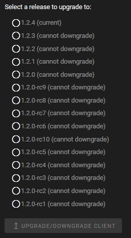

The FDM Monster Client bundle is available on two platforms, namely
[Github Releases](https://github.com/fdm-monster/fdm-monster-client/releases) and
[NPM package](https://www.npmjs.com/package/@fdm-monster/client).

The client bundle is also included as an NPM package for air-gapped installations, serving as an offline fallback.
Alternatively, and most commonly applied, the bundle is verified, downloaded, and extracted from Github during startup.

## Triggering Manual Update

To update the FDM Monster client bundle manually, navigate to the Help page and click on the **VISIT UPGRADE SETTINGS** button.

This will open the Software Upgrade page, where you can select the client version and click the **UPGRADE CLIENT** button
to trigger the update.

:::warning
Upon confirmation, the page will reload within 5 to 10 seconds and present you with the updated bundle.
:::
