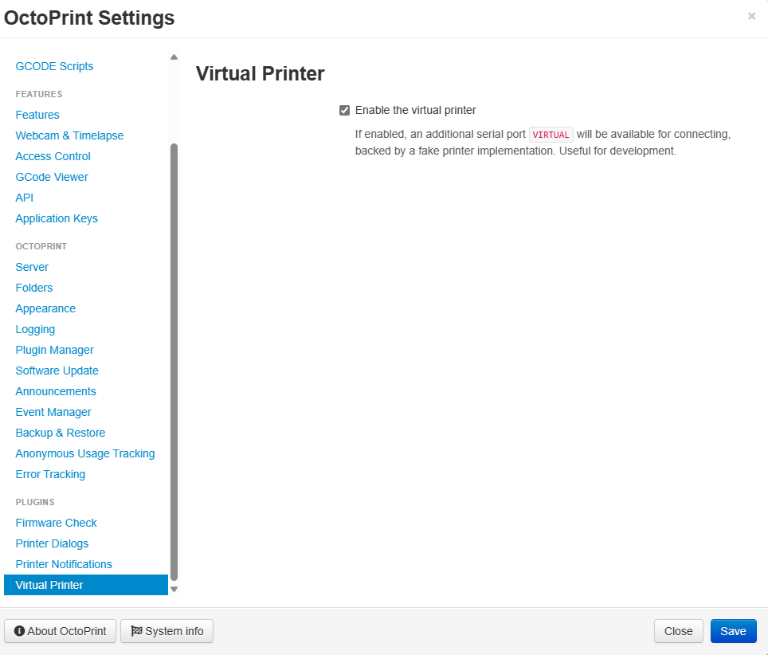
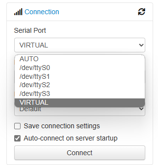

:::tip
We assume you have set up an OctoPrint installation before. This can be a development setup installation, an [OctoPi](https://octoprint.org/download/), or any other instance. Basic knowledge of OctoPrint is expected.
:::

The only difference we would like to suggest is to enable a Virtual Printer.

## Setting up an OctoPrint Virtual printer

A Virtual printer is a [default plugin](https://docs.octoprint.org/en/master/bundledplugins/virtual_printer.html) inside OctoPrint. It creates a special `VIRTUAL` interface that is not connected to a physical 3D printer but is perfect for testing FDM Monster development changes.

_To create a virtual printer, you can check the Virtual Printer checkbox in the OctoPrint settings._

## Setting up the VIRTUAL printer

After enabling the VIRTUAL printer, you will see a `VIRTUAL` option in the printer section on the OctoPrint dashboard

_OctoPrint dashboard with VIRTUAL printer available._

## Next Steps

Continue with the [Creating Printers](../software_usage/creating_printers.mdx) setup.
