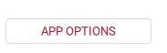
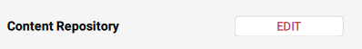
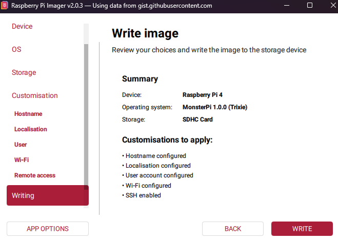

## What is MonsterPi?

- a [Raspberry Pi](https://www.raspberrypi.org/) image
- based on [Raspberry Pi OS Lite](https://www.raspberrypi.com/software/operating-systems/)
- built using [CustomPiOS](https://github.com/guysoft/CustomPiOS)
- running [FDM Monster](https://fdm-monster.net/)

## Before Installing MonsterPi

Before installing the MonsterPi image using either [Raspberry Pi Imager v2](#installing-monsterpi-with-raspberry-pi-imager-v2) or [Raspberry Pi Imager v1](#installing-monsterpi-with-raspberry-pi-imager-v1)

### Don't change username `pi`

:::warning
Users have reported problems changing the username other than `pi`. Please check [MonsterPi issue #132](https://github.com/fdm-monster/MonsterPi/issues/132) on GitHub if you want to see the status of this problem.
**For now, please leave the username on `pi`.**
:::

### Hardware requirements

We advise you to get these components for your setup. You might already have these or equivalents of them. All links point to the official Raspberry Pi website. From there links to (local) stores are provided.

| Component                       | Raspberry Pi 3                                                               | Raspberry Pi 4                                                                | Raspberry Pi 5                                                            |
|---------------------------------|------------------------------------------------------------------------------|-------------------------------------------------------------------------------|---------------------------------------------------------------------------|
| Raspberry Pi                    | [Product Link](https://www.raspberrypi.com/products/raspberry-pi-3-model-b/) | [Product Link](https://www.raspberrypi.com/products/raspberry-pi-4-model-b/)  | [Product Link](https://www.raspberrypi.com/products/raspberry-pi-5/)      |
| Raspberry Pi Case               | [Product Link](https://www.raspberrypi.com/products/raspberry-pi-3-case/)    | [Product Link](https://www.raspberrypi.com/products/raspberry-pi-4-case/)     | [Product Link](https://www.raspberrypi.com/products/raspberry-pi-5-case/) |
| Cooling                         | Not Required                                                                 | [Product Link](https://www.raspberrypi.com/products/raspberry-pi-4-case-fan/) | [Product Link](https://www.raspberrypi.com/products/active-cooler/)       |
| Power Supply                    | [Product Link](https://www.raspberrypi.com/products/micro-usb-power-supply/) | [Product Link](https://www.raspberrypi.com/products/type-c-power-supply/)     | [Product Link](https://www.raspberrypi.com/products/active-cooler/)       |
| 16GB or bigger Class 10 SD Card | [Product Link](https://www.raspberrypi.com/products/sd-cards/)               | [Product Link](https://www.raspberrypi.com/products/sd-cards/)                | [Product Link](https://www.raspberrypi.com/products/sd-cards/)            |

Additionally, depending on your computer, you might need a SD Card reader and (optionally) a micro SD Card to SD Card adapter.

:::warning
Please get a decent brand SD Card. **Do not save money on this.**
:::

## Installing MonsterPi with Raspberry Pi Imager v2

Raspberry Pi Imager v2 introduced changes that affect custom OS images like MonsterPi. While the image will flash successfully, OS customization options (WiFi, user settings, etc.) may not be available unless you configure a custom content repository.
This guide shows you how to enable full customization support for MonsterPi in Raspberry Pi Imager v2.

Follow the next steps to flash the MonsterPi image with customization options enabled:

### 1. Open App Options

Click **App Options** in the bottom right corner of Raspberry Pi Imager.



### 2. Edit Content Repository

Click **EDIT** next to "Content Repository".



### 3. Add Custom URL

- Either, you can copy the latest URL directly:

```bash
https://github.com/fdm-monster/MonsterPi/releases/latest/download/monsterpi-rpi-imager.json
```

- Or go to the [latest MonsterPi release](https://github.com/fdm-monster/MonsterPi/releases/latest) and copy the URL from the **Raspberry Pi Imager v2 - Custom OS (Recommended)** section in the release notes.

Finally, select **Use Custom URL** and paste the MonsterPi JSON URL.

### 4. Apply and Restart

Click **Apply & Restart** to reload the content repository.

### 5. Select MonsterPi

Choose **MonsterPi** from the OS list (look for "MonsterPi 1.0.0 (or higher) Trixie").

### 6. Configure OS Customization

You should now see the full OS customization settings available:



✅ You can now configure WiFi, hostname, user credentials, and other settings before flashing!

---

### Troubleshooting

#### Missing Customization Options

If customization options don't appear after selecting MonsterPi, you'll see a limited settings screen like this:


**Solution:** Follow the steps above to configure the custom content repository.

#### Alternative: Download Custom JSON File

Instead of using a URL, you can download the `monsterpi-rpi-imager.json` JSON file from the [latest release page](https://github.com/fdm-monster/MonsterPi/releases/latest/monsterpi-rpi-imager.json) and use the **Use Custom File** option in the Content Repository settings.

## Installing MonsterPi with Raspberry Pi Imager v1

:::info
These instructions are for Raspberry Pi Imager v1. For installation instructions using the latest Raspberry Pi Imager v2, please refer to section [Raspberry Pi Imager v2](#installing-monsterpi-with-raspberry-pi-imager-v2).
:::

### 1. Download the Monster Pi image

- Download the image by clicking this button: [](https://github.com/fdm-monster/monsterpi/releases/latest). Extracting the file is not required.
- Or browse all available releases here: [GitHub Releases](https://github.com/fdm-monster/MonsterPi/releases).

### 2. Download and install Raspberry Pi Imager

Download the imager using this link: [Raspberry Pi Imager v1](https://github.com/raspberrypi/rpi-imager/releases/tag/v1.9.6).

### 3. Review Raspberry Pi documentation

You can view [Raspberry Pi - Getting Started](https://www.raspberrypi.com/documentation/computers/getting-started.html) for more details to get started.
Be aware that the imager usage steps and screenshots are for Raspberry Pi Imager v2 (not v1).

### 4. Preparing the SD Card

Insert your SD Card into the SD Card reader of your PC.

### 5. Flashing image using Raspberry Pi Imager

1. Click on **Choose Device** and select the device matching your RaspberryPi device:

1. Click on **Choose OS**, scroll to the bottom, select **Use Custom**, and select the downloaded Monster Pi image on your computer.
1. Click on **Choose Storage**, and select your SD Card.

   :::danger Triple check this!
   Ensure you have selected the correct Storage!
   :::

1. Click on **Next** to continue configuring the Raspberry Pi Image.
1. The Raspberry Pi Imager will now ask you if you want to customize your image. Click on **Edit Settings** to start your configuration.
1. In the **General** section, check the checkbox for **Set Hostname** and name it `monsterpi`.

   :::info
   You can pick any name, but that will change steps later in the documentation
   :::

   Also check the **Set username and password** checkbox. Set the username to `pi` and the password to any value. This is required for enabling SSH later on.

   If required, change the WiFi and locale settings to your needs.

1. In the **Services** section, check the checkbox for **Enable SSH**. Depending on your preferences and setup, either select **Use password authentication** or **Allow public-key authentication only**
   :::info
   If you have an SSH Key, **Allow public-key authentication only** is advisable.
   :::
1. Click the **Save** Button at the bottom of the dialog. Once the dialog closes, click **Yes** to apply your customizations to the image.
1. After pressing **Yes** Raspberry Pi Imager will ask you for a confirmation to overwrite all data of the SD Card. Triple check if you have the correct storage device. Click **Yes** to continue.
1. Raspberry Pi Imager will now start writing and verifying the image to your SD Card. This steps takes some time and can vary depending on your USB Bus speed, SD Card and other factors, but will usually take about 5-10 minutes.
1. Once the verification is complete, by default, Raspberry Pi Imager will "eject" the device, play a sound and show a notification on the screen.

## First time starting up the Raspberry Pi

1. Insert the SD card into your Raspberry Pi and power it up.
   :::note
   The first power up can take some time. Wait up to 10 minutes before attempting a power cycle.
   :::
1. Visit [http://monsterpi.local:4000](http://monsterpi.local:4000) to access FDM Monster.

   Alternatively, you can visit [http://monsterpi.local](http://monsterpi.local) or [https://monsterpi.local (Self-Signed SSL Certificate)](https://monsterpi.local) to access FDM Monster.

## Upgrading FDM Monster in MonsterPi

:::warning
Upgrading MonsterPi requires you to have SSH knowledge. If you do not feel comfortable making those changes, please do
not continue and ask an expert to assist you!
:::

If you have not enabled SSH on your Raspberry Pi, you have a couple of options:

- enable SSH during the flashing step using Raspberry Pi Imager
- enable SSH with `sudo raspi-config` using screen and keyboard (you need a matching type of HDMI cable depending on which Pi you have)
- enable SSH by taking out the SD card, and adjusting it using another device of choice
  - shut down the Pi
  - get the SD card out
  - put the SD card in your card reader
  - create an empty file called `ssh` on the drive. Ensure you remove the extension!
  - Once you boot it up, SSH should be enabled.

### MonsterPi Version 1.0+

Run the following command as the `pi` user.

```bash
# Upgrade to the latest version
fdmm upgrade

# Upgrade to a specific version (see GitHub releases)
fdmm upgrade 2.x.y

# Update the CLI tool itself
fdmm update-cli
```

Refer to [Linux section](../installing/linux.mdx) for more details on the usages of `fdmm`/`fdm-monster` command-line interface.

### MonsterPi Version 0.4.0 - 0.5.0 (legacy)

Older MonsterPi's used a different setup and an unstable update script. Only by downloading the latest image, users will be able to use the latest MonsterPi and FDM Monster.

:::warning
Note that there is no upgrade path from 0.4.0-0.5.0 to 1.0.0+.
:::

```bash
cd ~/scripts

# Upgrade FDM Monster to latest
sudo bash ./update-fdm-monster.sh

# Upgrade FDM Monster, replacing `VERSION_HERE` with the tag (version) of FDM Monster you like.
sudo bash ./update-fdm-monster.sh --tag "VERSION_HERE" --non-interactive
```

For example, if you are running FDM Monster 1.6.2 and want to upgrade to 1.7.0, You would do the upgrade like this:

```bash
cd ~/scripts
sudo bash ./update-fdm-monster.sh --tag "1.7.0" --non-interactive
```

### Older MonsterPi versions to 0.1.0-0.3.2 (legacy)

:::warning
There is no upgrade path from MonsterPi 0.1.0-0.3.2 to 0.4. Only by downloading the new image, users will be able to use the latest MonsterPi and FDM Monster.
:::

It is advised to export a `.yaml` file to back up your printers, printer floor positions and floors.
Here are the steps to take:

1. Go to the import/export dialog to get the `.yaml` file as a download.
1. Check the file for missing or incorrect properties. Correct the mistakes with a text editor and save.
1. Refer to [YAML Import and Export](../configuration/yaml_import_export.mdx) for more details.
1. Ensure your .yaml is ready to be imported.
1. Flash a new SD card with the installation steps [above](#installing-monsterpi-with-raspberry-pi-imager-v2)
1. Ensure your MonsterPi is working. Proceed through the setup and create an account.
1. Import the YAML file according to [YAML Import and Export](../configuration/yaml_import_export.mdx#user-interface) for the import.
1. Your printers and floors will reappear.
