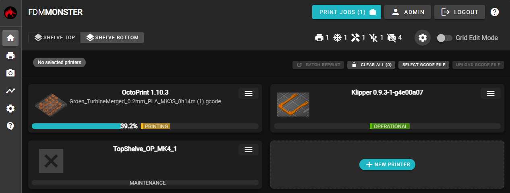

FDM Monster is capable of connecting to over 100 OctoPrint instances allowing you to be able to manage your 3D Printing Farm using a single view!

## FDM Monster

The quickest way to get started is by using either the [MonsterPi](./installing/monsterpi.mdx) image or by using [Docker Compose](./installing/docker_compose.mdx).

Please keep in mind that the Docker Compose route will be a bit more advanced and knowledge of Docker and Docker Compose is required.
