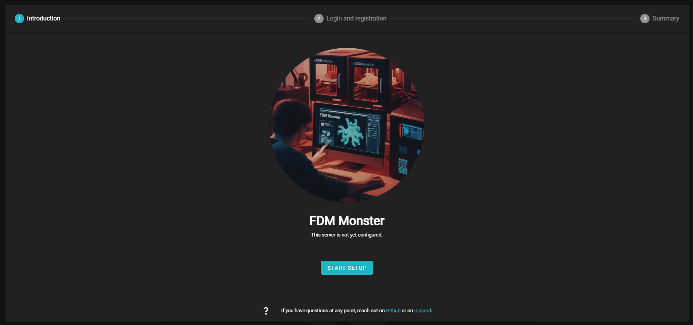
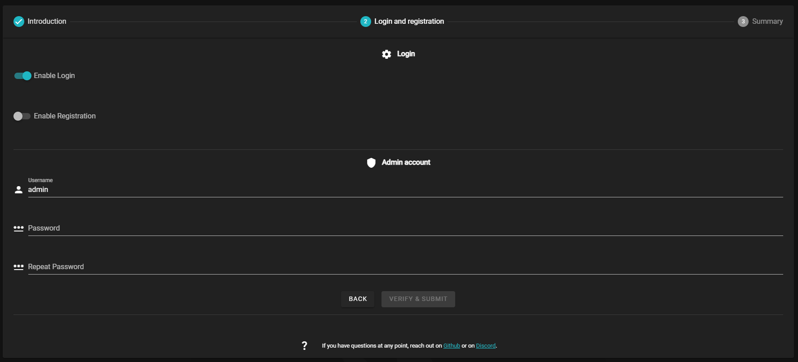
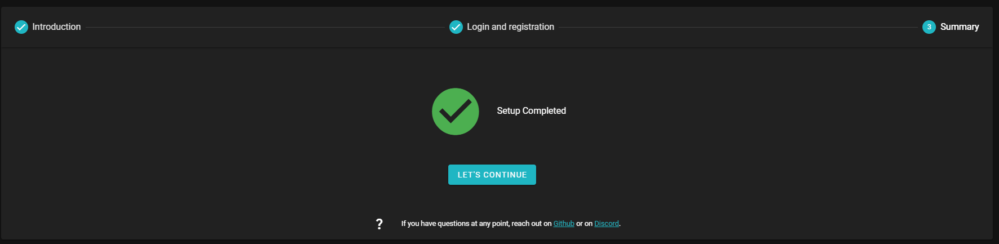
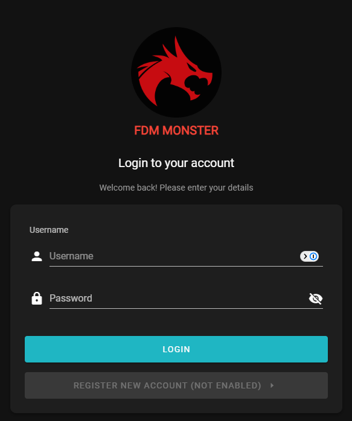

After you have installed FDM Monster, you'll need to head to the FDM Monster URL. This URL depends on your installation method.

The first time setup steps consists of 3 steps in total.

## Introduction

When going to the web application for the first time, you will be greeted with the image below. Click on the **[START SETUP]** button to get started!

## Login and registration

This step is used to create the admin account and initial login settings. The settings are described below.

### Login

- **Enable Login** - this setting is enabled by default, you could disable this to have no logins required for FDM Monster.
  :::danger
  FDM Monster Team advises you to keep this enabled for security reasons.
  :::
- **Enable Registration** - this setting allows other users to register an account on your FDM Monster installation. If your environment requires so, you could enable this setting.

### Admin account

- **Username** - this is set, by default, to admin. Depending on the public exposure of FDM Monster, this value should be changed to something unique
- **Password** - this is the password for the admin account.
  :::info
  FDM Monster Team advises you to create a strong password and keep it in a safe place
  :::
- **Repeat Password** - repeat the password for the admin account. This should be the same as the previous one.

### Buttons

- **[BACK]** - Return to the [previous](#introduction) screen.
- **[VERIFY & SUBMIT]** - Submit the changes and continue. This button will be enabled once all mandatory fields are filled in

## Summary

The summary step is shown. Only one button is available. Click on the **[LET'S CONTINUE]** button to continue to the login screen

## Login to your account

After you completed the First Time Setup steps, you'll be sent over to the **Login to your account** window, unless you have opted out to login.

