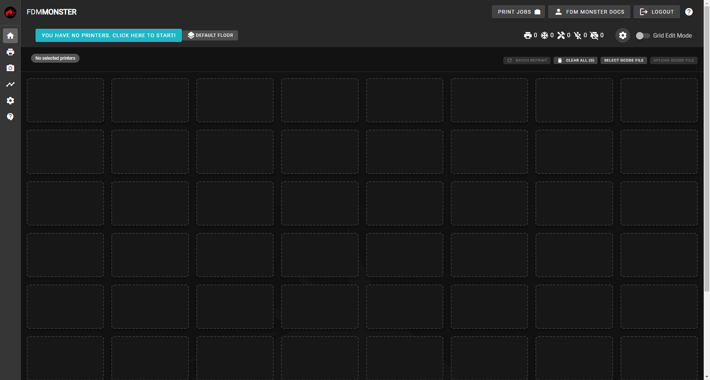
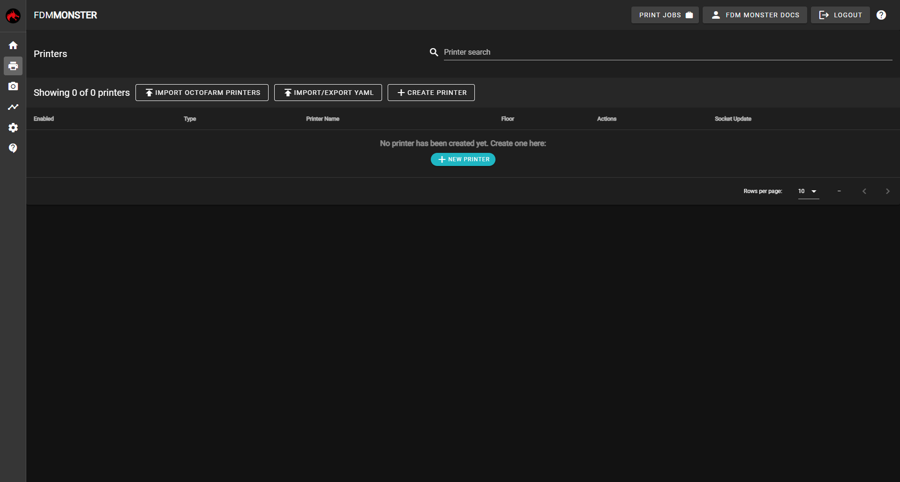
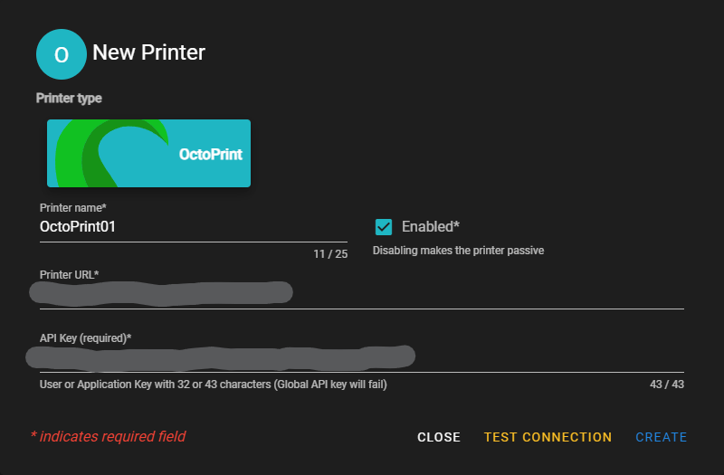
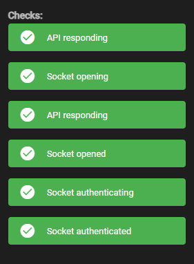
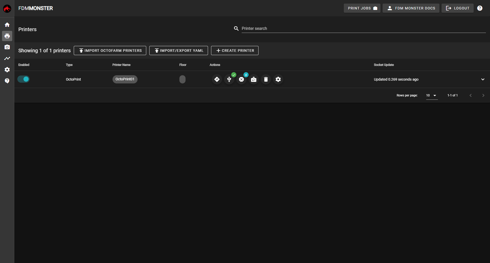
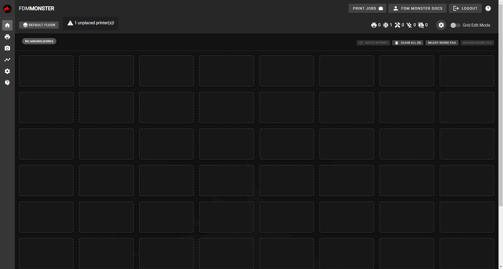
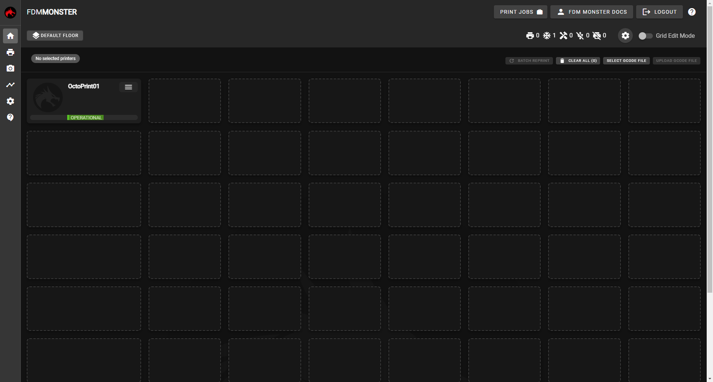

First start with the [Installation](../installing/index.mdx). Once installed, complete the [First Time Setup](./first-time-setup.mdx) wizard, you'll be greeted with an empty FDM Monster instance.

:::warning
This guide will not help you setup your OctoPrint or Moonraker instance. There are so many variations on how you could set those up, it's beyond the scope of the documentation. For setting up OctoPrint or Moonraker, please follow their documentation.

We also assume you have basic knowledge on how to operate your OctoPrint and/or Moonraker installations.
:::

:::info
If you only have Moonraker printers, these steps are slightly different. You'll need to enable [Moonraker](./moonraker.mdx) support first
:::

The getting started guide will not have instructions for setting up your shelving units. For more information about setting these up, have a look at the [Grid Settings](./menu/settings/grid_settings.mdx) page.

There should be a button `YOU HAVE NO PRINTERS. CLICK HERE TO START` on top of your screen. This is our starting point. When you press that button, you will be sent to the **<IIcon icon="mdi:printer" /> Printers** page. This page allows you to add your printers.

On this page, we are going to click the **<IIcon icon="mdi:add" /> CREATE PRINTER** button.

:::note
The Printer name is generated. This name will be different each time you open the dialog.
:::

Adjust the fields described below, according to your needs.

- **Name** The name of your printer. Should be unique within FDM Monster. This is how you can identify your printer.
- **Enabled** Checkbox to enable or disable your printer
- **Printer URL** The full URL to your printer. For OctoPrint this is usually the same URL as you use to access your OctoPrint web interface
- **API Key** A newly generated Application Key for your OctoPrint installation. Advanced documentation can be found [here](https://docs.octoprint.org/en/master/bundledplugins/appkeys.html)

Once all fields are correctly populated, press the **TEST CONNECTION** button. If everything is correct, all checks should pass

Click on the **CREATE** button.

If you have done everything correctly one printer should be visible in the overview.

After adding your printer, you'll need to place your printer on your floor and shelving unit. You'll need to go back to the  **<IIcon icon="mdi:home" /> Home** page. Click on the **<IIcon icon="mdi:home" />** icon on the left.

For now, we are going to keep it simple and just add the printer to the top left tile.

On the top right of your window, a slider **Grid Edit Mode** should be available. By enabling that slider, you should be able to move printers to any tile you wish. After enabling that slider, Drag and Drop your printer into the top left tile. Once completed, disable the **Grid Edit Mode** slider.

