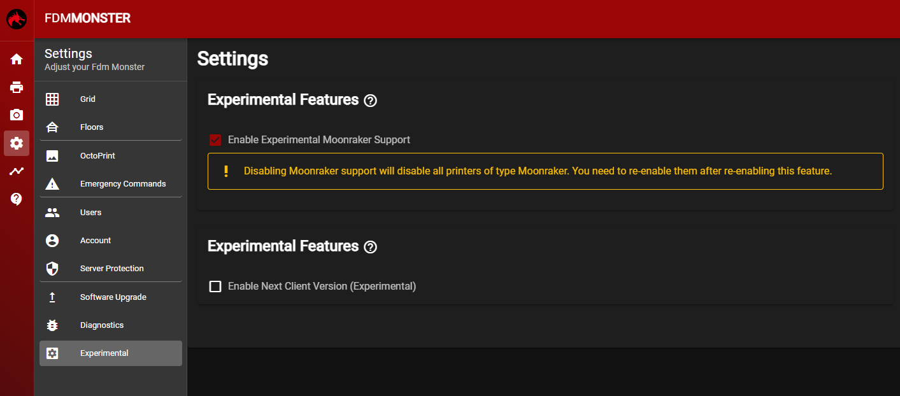

:::note NOTE
Moonraker support was added in FDM Monster 1.7.0.
:::

After you have setup your FDM Monster installation, you can enable experimental features. One of these features is Klipper support.

1. Once logged in, click the cogwheel ⚙️ on the left side menu.
1. On the bottom click the **experimental** menu option.
1. Check the checkbox before **Enable Experimental Moonraker Support**.

