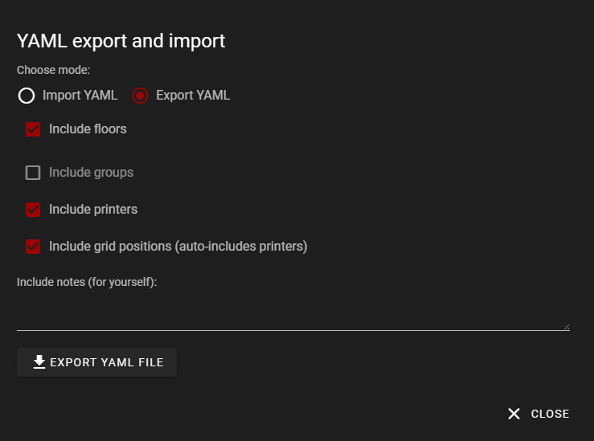
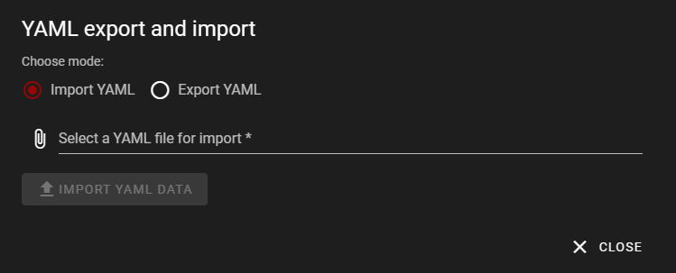
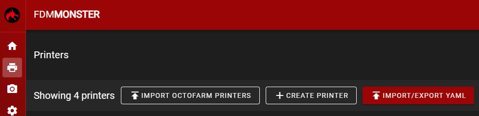

The YAML import/export function allows users to export and import their printer and floor configurations in a YAML format.

## YAML File Format

Here is an example of a YAML file generated by the export function:

```yaml
version: 1.5.1
exportedAt: 2023-11-11T09:02:41.703Z
config:
  exportPrinters: true
  exportFloorGrid: true
  printerComparisonStrategiesByPriority:
    - name
    - url
  exportFloors: true
  floorComparisonStrategiesByPriority: floor
  notes: 'Some notes, made this layout for the summer 23'' setup '
printers:
  - id: 648f3e6d372112628bb8e404
    disabledReason: null
    enabled: true
    dateAdded: 1687109229334
    name: Dragon Eggggg
    printerURL: http://demo.fdm-monster.net:5001
    apiKey: asdasdasdasdasdasdasdasdasdasdas
floors:
  - id: 64427f2d070a27047acd5e6e
    floor: 2
    name: Default Floor1_5_1
    printers:
      - floorId: 64427f2d070a27047acd5e6e
        printerId: 648f3e6d372112628bb8e404
        x: 0
        'y': 0
```

The YAML file contains the following sections:

- **version**: The version of the YAML format used in the file.
- **exportedAt**: The date and time when the file was exported.
- **config**: The configuration settings used during the export process.
- **printers**: The list of printers and their settings.
- **floors**: The list of floors and their associated printers.

## User Interface

Here are some screenshots of the user interface for the YAML import/export function:







The first screenshot shows the main interface for the import/export function. The second screenshot shows the import dialog, where users can select a YAML file to import. The third screenshot shows the import button, which users can click to begin the import process.

## Conclusion

The YAML import/export function provides a convenient way for users to backup and transfer their printer and floor configurations. By following the format described in this documentation, users can ensure that their YAML files are correctly formatted for import.
