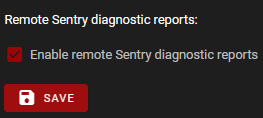

The FDM Monster webapp has a diagnostics page that can be used to configure Sentry diagnostics.
Sentry is a service that collects errors and warnings from the FDM Monster webapp and sends them to the developers.
This allows the developers to fix bugs and improve the software. Note that this is an opt-in feature, and that
you can disable it at any time. Also note that no personal information is sent to Sentry.

_Check or uncheck the checkbox and press save to enable or disable Sentry._
